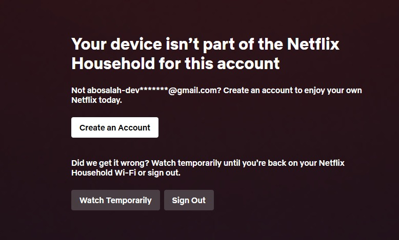

# Netflix Household Bypass

A Chrome extension that bypasses the **"Your device isn't part of the Netflix Household for this account"** restriction and provides custom video controls.

---

## 🚫 The Problem

This extension bypasses the following Netflix restriction:

---

## ✨ Features

### 🔓 Household Bypass
- Automatically removes the Netflix Household restriction popup
- Works instantly when the popup appears
- Shows a confirmation toast: **"✅ Netflix block bypassed"**

### 🎬 Video Controls
- **Play/Pause Button** — Netflix-red floating button
- **Speed Control** — Slider to adjust playback speed (0.5x to 2x)
- **Auto-hide** — Controls fade out after 2 seconds of inactivity

---

## 📦 Installation

### Chrome / Edge / Brave

1. Download or clone this repository
2. Open your browser and go to `chrome://extensions/`
3. Enable **Developer mode** (toggle in top-right)
4. Click **Load unpacked**
5. Select the extension folder
6. Done! ✅

---

## 🎯 How It Works

The extension uses a **MutationObserver** to detect when Netflix injects the Household restriction dialog into the DOM. When detected, it:

1. Checks if the popup contains "Netflix Household" text
2. Removes the popup element from the DOM
3. Shows a toast notification confirming the bypass

**No network interception. No reverse engineering. Pure DOM manipulation.**

---

## 🛠️ Files

| File | Description |
|------|-------------|
| `manifest.json` | Extension configuration (Manifest V3) |
| `content.js` | Main script — popup remover + video controls |

---

## ⚠️ Disclaimer

This extension is for **educational purposes only**. Use at your own risk. The developer is not responsible for any consequences of using this extension. Netflix may update their DOM structure at any time, which could affect functionality.

---

## 📄 License

MIT License — feel free to modify and distribute.

---

**Made with ❤️ by Ahmed Salah**
